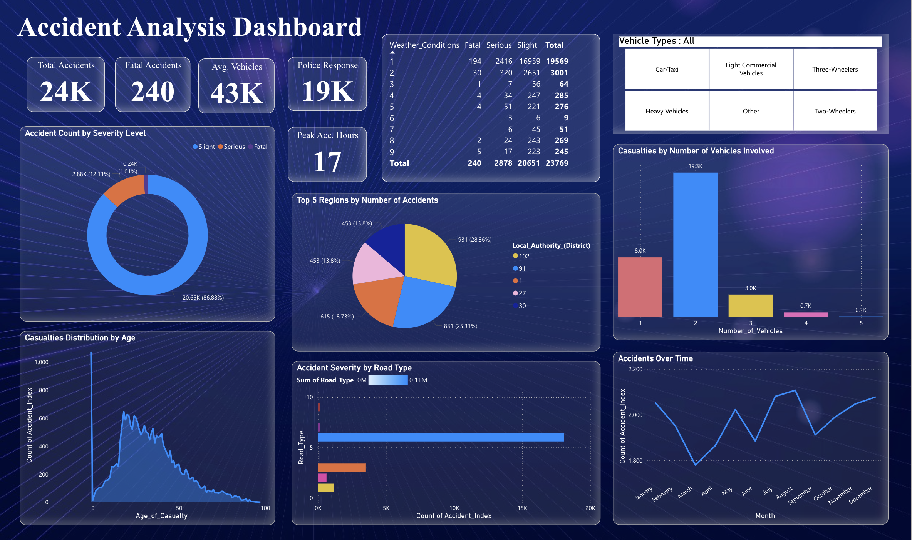
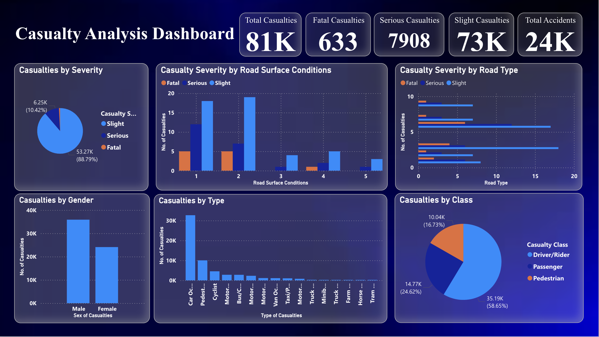

# 🚦 Accident Data Analysis Dashboard – Power BI

## 📌 Overview
The **Accident Data Analysis Dashboard** is a Power BI report designed to explore and visualize traffic accident data.  
It provides insights across three key perspectives:  
- **Accidents** – Where, when, and how accidents happen  
- **Vehicles** – The types and counts of vehicles involved  
- **Casualties** – The human impact of accidents  

---

## 📂 Project Structure
| File | Description |
|------|-------------|
| `Accident_Analysis_Dashboard.pbix` | Main Power BI report file |
| `Accident Data Analysis Problem Statement.docx` | Project goals & problem statement |
| `Report.pdf` | Exported static version of dashboard |
| `Data Files/` | Datasets used in the analysis |

---

## 📊 Dashboard Pages

### 1️⃣ Accident Sheet
Provides an overview of all reported accidents, trends, and severity distribution.

**Key Features**
- Accident trends over time  
- Severity-level breakdown  
- Filters for date range and location  
- Visual maps for geographic accident distribution  

---

### 2️⃣ Vehicles Sheet
Focuses on vehicles involved in accidents.

**Key Features**
- Vehicle type and count comparisons  
- Charts showing vehicle involvement by severity  
- Drill-down capability by time and region  

---

### 3️⃣ Casualties Sheet
Analyzes the human impact of traffic accidents.

**Key Features**
- Fatalities vs. injuries over time  
- Demographic breakdowns (if available)  
- Severity and outcome trends  

---

## 📈 Example Insights
- **Seasonal Trends**: Accidents peak during certain months  
- **Vehicle Type Impact**: Two-wheelers involved in majority of cases  
- **Casualty Severity**: Serious injuries correlate with certain accident types  

---

## 📥 How to Use
1. Open `Accident_Analysis_Dashboard.pbix` in **Power BI Desktop**.
2. If external data files are used, refresh the dataset.
3. Navigate using the tabs: **Accidents**, **Vehicles**, **Casualties**.
4. Apply slicers and filters to customize the view.
5. Export visual insights for presentations or reports.

---

## 🔮 Future Improvements
- Integration of **real-time traffic accident data**  
- Predictive accident risk modeling  
- Enhanced demographic and geospatial analysis  

---

## 📬 Contact
**Author**: Dhruv  
GitHub: [Dhruv-201004](https://github.com/Dhruv-201004)

---
